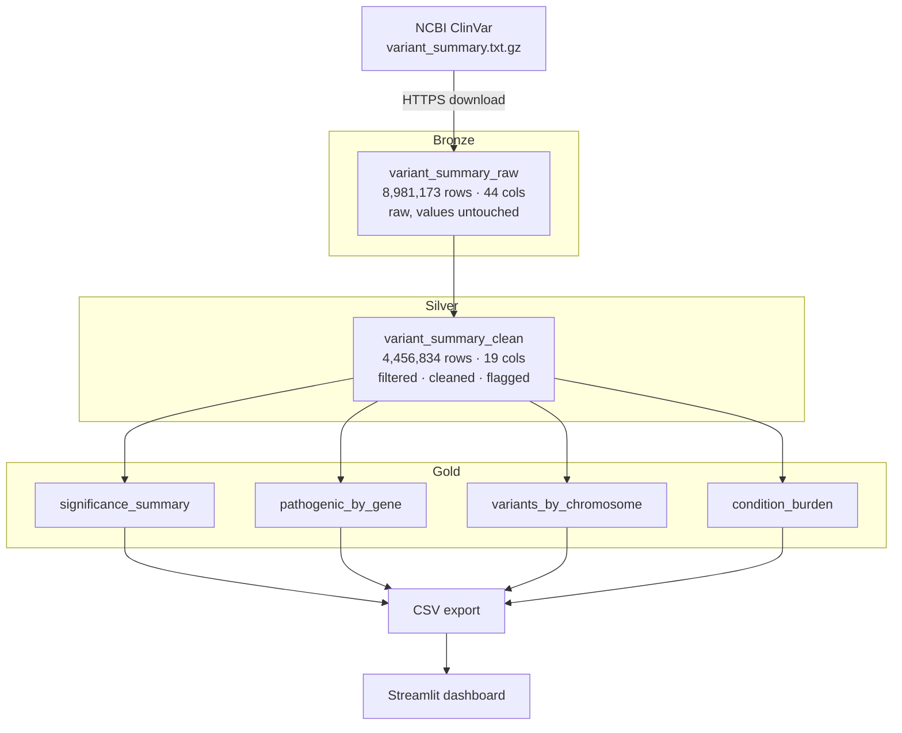
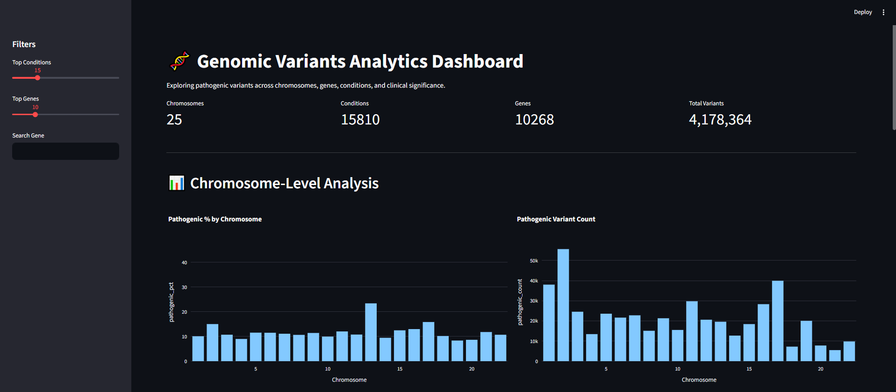
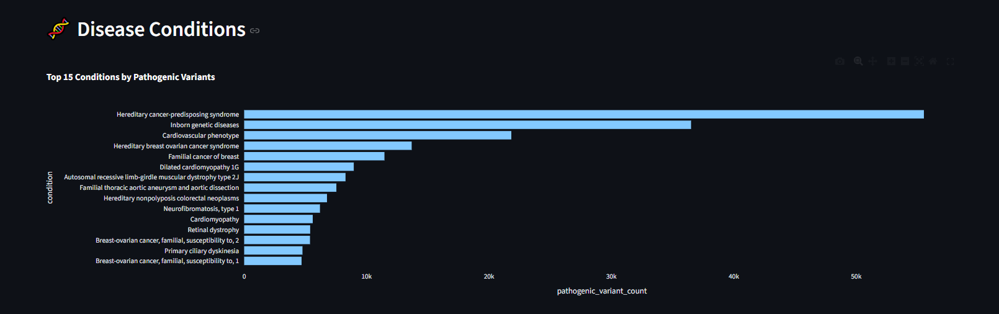
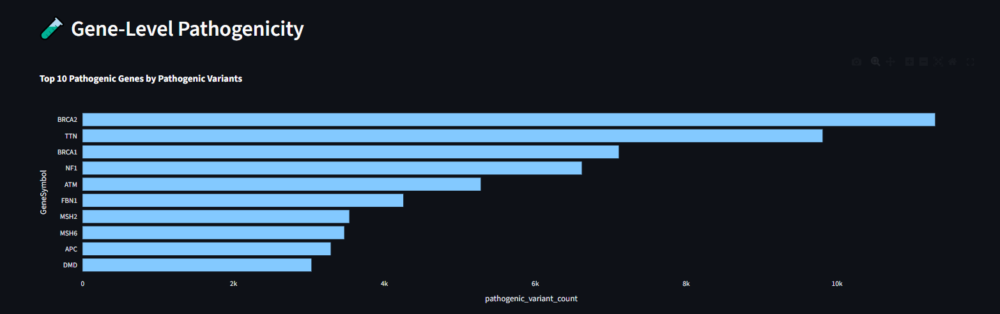
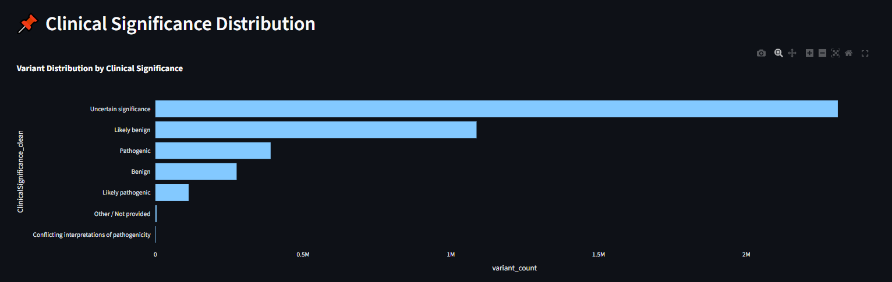

# ClinVar Medallion Pipeline
 
A data engineering pipeline that ingests, cleans, and aggregates the public **ClinVar** genomic-variant dataset on Databricks, following the **Medallion Architecture** (Bronze → Silver → Gold). The Gold layer powers an interactive Streamlit dashboard.
 
ClinVar is NCBI's public archive linking human genetic variants to their clinical significance — whether a variant is pathogenic (disease-causing), benign, or of uncertain significance — and to the conditions they are associated with. This project turns the raw ~9-million-row release into four small, query-ready analytical tables.
 
---
 
## Why this project
 
The interesting engineering challenge in ClinVar is not volume — it is **data quality and auditability**. The raw file mixes two genome builds (doubling every variant), hides missing values behind text markers, packs free-text clinical labels into single fields, and combines multiple conditions per row with inconsistent separators. This pipeline addresses each of those issues explicitly, and — importantly for a regulated/clinical context — it **flags bad records rather than dropping them silently**, so every row can be accounted for.
 
---
 
## Architecture
 

 
Each layer reads only from the previous layer's **table**, never from the raw file. This means any layer can be reprocessed from the immutable Bronze source without re-downloading, and any Gold number can be traced back through Silver to a raw Bronze record.
 
---
 
## The layers
 
### Bronze — raw fidelity
Downloads the gzipped TSV from NCBI (streamed in 8 KB chunks so memory stays flat regardless of file size) and writes it to Delta **with no transformation of any value**. The only changes are three column renames required by Delta (`#AlleleID`, `RS# (dbSNP)`, `nsv/esv (dbVar)`) and one added `ingestion_timestamp` column for audit. Result: **8,981,173 rows × 44 columns.**
 
### Silver — cleaning, standardisation, quality flagging
This is where the real transformation happens:
 
| Step | What it does |
|---|---|
| Filter to GRCh38 | Removes the duplicate GRCh37 build (and legacy `na`/`NCBI36`). Drops 4,524,339 rows (50.4%) — without this, every downstream count would be roughly doubled. |
| Markers → nulls | Converts NCBI's text placeholders (`-`, `na`) into real nulls, so missing-value checks actually work. |
| Standardise significance | Maps the free-text `ClinicalSignificance` field to 7 canonical categories via a priority-ordered keyword match. |
| Cast types | `GeneSymbol` → uppercase (so the same gene can't split across casings); `LastEvaluated` → real `date` via a Python UDF that sidesteps a Serverless config lock on Spark's date parser. |
| Flag, don't drop | Adds `dq_flag` / `dq_reason`. Rows failing a quality check are **kept and labelled**, never deleted. |
 
Result: **4,456,834 rows × 19 columns**, of which **4,177,604 (93.7%) are clean** and **279,230 (6.3%) are flagged**.
 
Row-count reconciliation is printed at the end of Silver so every record is accounted for:
 
```
Bronze (all assemblies) : 8,981,173
Silver (GRCh38 only)    : 4,456,834
Dropped by assembly     : 4,524,339
Silver clean rows       : 4,177,604
Silver flagged rows     :   279,230
```
 
Flag breakdown:
 
| dq_reason | rows |
|---|---|
| Missing clinical significance | 245,121 |
| Missing or unparseable evaluation date | 31,793 |
| Missing gene symbol | 1,547 |
| Missing phenotype | 769 |
 
### Gold — purpose-built analytical tables
Reads the clean Silver rows (`dq_flag = False`) and builds four small, pre-answered tables, each addressing one analytical question. "Actionable" / pathogenic burden is defined once in `00_setup` as **Pathogenic + Likely pathogenic** (per ACMG/AMP, both are clinically actionable) and reused across all relevant tables.
 
---
 
## The four Gold tables
 
### 1. `significance_summary` — variant counts by clinical significance (7 rows)
 
| ClinicalSignificance_clean | variant_count | pct_of_total |
|---|---:|---:|
| Uncertain significance | 2,309,419 | 55.28% |
| Likely benign | 1,086,898 | 26.02% |
| Pathogenic | 389,727 | 9.33% |
| Benign | 274,957 | 6.58% |
| Likely pathogenic | 112,380 | 2.69% |
| Other / Not provided | 4,091 | 0.10% |
| Conflicting interpretations of pathogenicity | 132 | 0.00% |
 
*(Pathogenic + Likely pathogenic = 502,107 clinically actionable variants.)*
 
### 2. `pathogenic_by_gene` — top genes by actionable variant count (10,244 genes)
 
| Gene | Count | | Gene | Count |
|---|---:|---|---|---:|
| BRCA2 | 11,295 | | FBN1 | 4,249 |
| TTN | 9,801 | | MSH2 | 3,535 |
| BRCA1 | 7,102 | | MSH6 | 3,468 |
| NF1 | 6,611 | | APC | 3,286 |
| ATM | 5,276 | | DMD | 3,033 |
 
The leading genes — BRCA1/2, MSH2/MSH6, MLH1, APC, ATM, PALB2 — map directly to hereditary cancer-predisposition syndromes, a core clinical-genomics focus area. (TTN ranks high partly because titin is the largest human gene and accumulates many variants by size.)
 
### 3. `variants_by_chromosome` — distribution and pathogenic proportion (26 rows)
Computes total variants and pathogenic count per chromosome in a single pass. The pathogenic *proportion* reveals genuine biology rather than just counts: **Chr13 has the highest pathogenic rate (23.39%)** despite modest totals (it carries BRCA2 and RB1), **Chr X is second (20.39%)** reflecting X-linked disorders, and **mitochondrial DNA is lowest (5.62%)**.
 
### 4. `condition_burden` — top conditions by actionable variant burden (15,797 conditions)
 
| Condition | Count |
|---|---:|
| Hereditary cancer-predisposing syndrome | 55,530 |
| Inborn genetic diseases | 36,495 |
| Cardiovascular phenotype | 21,825 |
| Hereditary breast ovarian cancer syndrome | 13,684 |
| Familial cancer of breast | 11,457 |
| Dilated cardiomyopathy 1G | 8,949 |
 
The top conditions cluster around **oncology** (hereditary cancer syndromes, breast/ovarian, Lynch) and **cardiovascular** disease (cardiomyopathies, thoracic aortic aneurysm, Long QT) — both major therapeutic areas in clinical genomics.
 
---
 
## Tech stack
 
- **Databricks** (Serverless Compute) with **Unity Catalog** governance
- **PySpark 4.1** + **Delta Lake**
- **Python** (`requests` for ingestion, a date-parsing UDF)
- **Streamlit** + **Plotly** for the dashboard
---
 
## Repository structure
 
```
.
├── databricks_notebooks/
│   ├── 00_setup.ipynb              # config, schema/volume creation, constants, validation
│   ├── 01_bronze_ingestion.ipynb   # download + raw load to Delta
│   ├── 02_silver_transform.ipynb   # filter, clean, standardise, flag
│   └── 03_gold_aggregations.ipynb  # four analytical tables + CSV export
├── data/
│   ├── gold_chromosome.csv         # exported Gold tables (read by Streamlit)
│   ├── gold_condition.csv
│   ├── gold_pathogenic.csv
│   └── gold_significance.csv
├── streamlit/
│   └── app.py                      # dashboard (reads Gold CSVs)
└── README.md
```
 
---
 
## How to run
 
1. Run the notebooks **in order** (`00` → `01` → `02` → `03`). Each notebook re-runs `00_setup` via `%run`, so configuration and constants are always in scope.
2. `00_setup` creates the `workspace.clinvar` schema and the `raw_files` volume, and validates the environment before anything else runs.
3. `03_gold_aggregations` finishes by exporting the four Gold tables to CSV in the volume — these are what the Streamlit app reads.
4. Each notebook ends with a validation gate that reads its output **back from disk** (not from the in-memory DataFrame) and prints a pass/fail summary, so a failed write surfaces immediately.
---
 
## Engineering highlights
 
A few decisions and findings worth calling out:
 
- **Flag-don't-drop data quality.** 279,230 imperfect rows are preserved in Silver with a reason, not deleted — so the question "what happened to those variants?" always has an answer. Clean analysis filters `dq_flag = False`; investigations can query the flagged rows directly.
- **Row-count reconciliation at the layer boundary.** Silver prints the full arithmetic (Bronze → dropped → clean + flagged) so the pipeline is auditable end to end.
- **Native expressions vs UDF — chosen deliberately.** Significance cleaning uses a native Spark column expression (fast, no serialisation overhead). Date parsing uses a Python UDF *on purpose*, because Serverless locks Spark's native date parser — `strptime` in plain Python is immune to that lock.
- **A significance-mapping bug, found and fixed.** Substring matching originally tested `"pathogenic"` before `"likely pathogenic"`, silently collapsing ~112,000 likely-pathogenic variants into the pathogenic count. Reordering the conditions (specific before general) separated them correctly — confirmed because the split parts sum exactly to the original combined total.
- **A separator bug in conditions, found and fixed.** `PhenotypeList` uses *both* `|` and `;` as separators; splitting on `|` only left phantom combined rows and understated individual conditions (e.g. dilated cardiomyopathy by ~4–5×). Splitting on both collapsed the duplicates and dropped the distinct-condition count from 21,842 to 15,797.
- **Single source of truth.** Catalog/table names, the target genome build, and the "actionable" category list are each defined once in `00_setup` and reused everywhere.
- **DLT-ready by design.** Each Gold transformation includes a commented Delta Live Tables (`@dlt.table`) declaration showing how it would run as a managed pipeline in a full workspace.
---
 
## Known limitations
 
- **Community/Serverless constraints.** All three layers share one `clinvar` schema (separate bronze/silver/gold schemas aren't available here); the layer is encoded in the table name instead. The architecture is written for separate schemas with schema-level access control in a full workspace.
- **Condition placeholders.** Generic placeholder conditions (`not provided`, `not specified`, etc.) are filtered, but the cleanup is heuristic — a production version would reconcile condition names against an ontology such as MedGen.
- **Significance mapping is keyword-based.** It maps ClinVar's free-text labels to 7 canonical categories via priority-ordered matching; rare or newly renamed labels fall into "Other / Not provided".
- **Counts are variant–condition links.** In `condition_burden`, a variant linked to multiple conditions contributes to each — the correct grain for per-condition burden, but not a count of unique variants.
---
 
## Dashboard
 
The Streamlit dashboard reads the four exported Gold CSVs and presents one panel per table.
 
**Running locally:**
 
```bash
pip install streamlit plotly pandas
streamlit run streamlit/app.py
```
 
The app expects the four CSVs in a `data/` directory relative to the repo root, which matches the repository structure above.
 
**Panels:**
 
| Panel | Source table | Chart type |
|---|---|---|
| Clinical significance distribution | `gold_significance.csv` | Horizontal bar chart |
| Top genes by pathogenic variant count | `gold_pathogenic.csv` | Horizontal bar chart with top-N slider |
| Variant distribution by chromosome | `gold_chromosome.csv` | Bar chart, ordered by chromosome number |
| Top conditions by pathogenic burden | `gold_condition.csv` | Horizontal bar chart with top-N slider |
 
A sidebar provides two sliders (top N conditions, top N genes) and a gene name search box. KPI tiles at the top show total chromosomes, distinct conditions, distinct genes, and total variant count across all categories.





---
 
*Data source: [NCBI ClinVar](https://www.ncbi.nlm.nih.gov/clinvar/) (public domain).*
